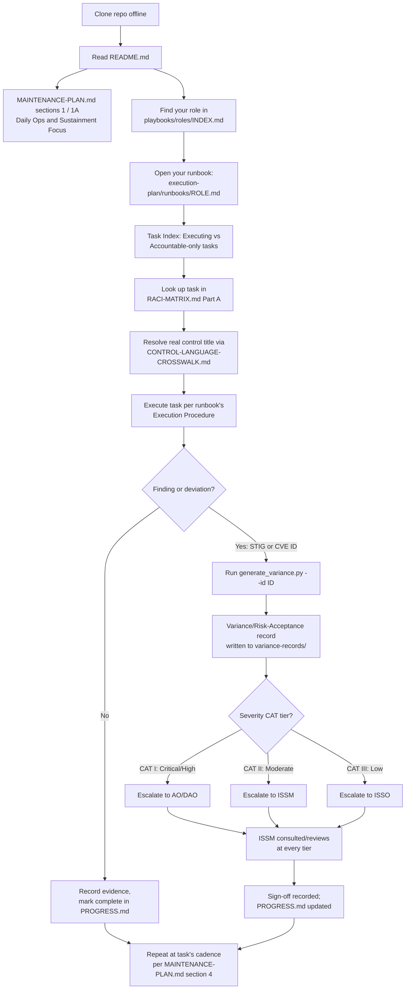

# JSIG Operational Maintenance & Sustainment Playbook

A network-agnostic, offline-usable reference and maintenance-planning repository for systems governed by the **DoD/IC Joint Special Access Program (SAP) Implementation Guide (JSIG)**, 2016-04-11, Rev. 4 — the risk management framework (RMF) overlay on [NIST SP 800-53 Rev. 4](https://csrc.nist.gov/CSRC/media/Projects/risk-management/800-53%20Downloads/800-53r4/800-53-rev4-controls.xml) used across the DoD Special Access Program community.

Primary source: [JSIG PDF, DCSA](https://www.dcsa.mil/portals/91/documents/ctp/nao/JSIG_2016April11_Final_(53Rev4).pdf).

> **Scope note:** This repository contains only unclassified, general-framework reference material — the public JSIG document structure, publicly available NIST/FedRAMP/DoD/IRS/GSA cadence guidance, and derived planning artifacts. It contains no program-specific, classified, or controlled system data. It is a **planning and reference resource**, not an authorization package or a substitute for organization-specific JSIG tailoring, ODP (organization-defined parameter) determination, or AO/ISSM sign-off.

## Why this repo exists

Standing up and sustaining a JSIG-governed system requires (a) knowing exactly which of the 26 control families and ~274 controls apply, (b) knowing who is responsible for what per JSIG §1.5, and (c) running an actual recurring maintenance cadence rather than treating RMF as a one-time authorization event. This repo assembles all three into one clone-and-use offline package.

## Repository layout

```
reference/JSIG/                     # Control-family reference (26 families, 274 controls)
  README.md                         # Overview + extraction status
  control-families/INDEX.md         # Master index of all 26 families
  control-families/<CODE>.md        # One file per family: control IDs, titles, NIST baseline text, JSIG notes
  appendices/                       # References, acronyms, SAP baselines, definitions, extraction limitations

references/JSIG-source/             # Verbatim/near-verbatim JSIG PDF extractions (offline copies)
  section-1.5-roles-and-responsibilities.md   # All 17 JSIG roles, verbatim
  section-1.6-...md, section-2-rmf-process.md
  chapter-3-<FAMILY>-family.md      # Verbatim Chapter 3 body text for MA, AU, CM, SI, CA, CP, IR, PE, AC
  appendix-b-acronyms.md, appendix-c-baselines-partial.md, appendix-e-definitions.md
  EXTRACTION-LOG.md                 # What was successfully extracted verbatim vs. still needs manual pull

references/external-sources/        # Offline copies of every external source cited in the research/plan
  INDEX.md                          # Full source list with URLs and what each supports
  (FedRAMP SSP Appendix A Low/Mod/High, FedRAMP ConMon Playbook, IRS Pub 1075, NIST SP 800-137/61/40/34,
   NIST 800-53 Rev4 XML catalog, DoD Cybersecurity Discipline Implementation Plan, GSA Contingency
   Planning Guide, DISA STIG examples, CMS/HHS ARS & POA&M guidance, USMC IAVM bulletin, etc.)

research/operational-maintenance-schedules-research.md   # Cadence research compiled from all sources above

playbooks/roles/                    # Network-agnostic operational playbook per JSIG §1.5 role (17 roles)
  INDEX.md                          # All roles, grouped by hierarchy, linked
  <Role>.md                        # Role summary, JSIG-cited duties, daily/recurring ops mapped to controls,
                                     # coordination interfaces, key artifacts owned

MAINTENANCE-PLAN.md                 # THE actionable plan: daily ops & sustainment focus, per-family cadence
                                     # tables + deep-dive domain analysis, 110-task master calendar,
                                     # roles matrix, phased implementation sequencing, risks/gaps

execution-plan/                     # Actionable, generate-and-use tooling built on top of everything above:
  README.md                         # Start here for this folder -- RACI matrix, 17 role runbooks, escalation
                                     # routing, variance-record generation, STIG/CVE reference tooling
  RACI-MATRIX.md                    # Generated Responsible/Accountable/Consulted/Informed for all 110 tasks
  CONTROL-LANGUAGE-CROSSWALK.md     # Reconciles every Control ID cited in the calendar against real JSIG titles
  runbooks/<Role>.md                # Actionable per-role task runbook, one per JSIG role

PROGRESS.md                         # Implementation tracking checklist (fill in as you stand up the program)
AGENTS.md                           # How AI coding/planning agents should work in this repo
manifest.txt                        # Flat file inventory
```

## How to use this offline

0. First time here? Run `python3 start_here.py` for an interactive setup wizard -- checks your environment, optionally records who holds each of the 17 JSIG roles (local-only, never committed), and walks you through importing STIG/CVE/Nessus data with a practice output record at the end. See `execution-plan/tools/README.md` for details. Safe to re-run any time; entirely optional.
1. Clone the repo — no internet access is required afterward. All external guidance cited in `MAINTENANCE-PLAN.md` and the research file has a local copy under `references/external-sources/`.
2. Start with `MAINTENANCE-PLAN.md` §1 (Executive Summary) and §1A (Daily Operations & Sustainment Focus) for the day-to-day checklist.
3. Look up your role in `playbooks/roles/INDEX.md` for what you specifically own, then find your role's actionable task runbook in `execution-plan/runbooks/` (start with `execution-plan/README.md`).
4. Use `reference/JSIG/control-families/INDEX.md` for the control inventory, and `references/JSIG-source/chapter-3-*-family.md` for the full verbatim JSIG family text (real ODP values and SAP-specific guidance) -- the latter supersedes the former's NIST-boilerplate placeholders; see `reference/JSIG/appendices/EXTRACTION-LIMITATIONS.md` for what changed. `execution-plan/CONTROL-LANGUAGE-CROSSWALK.md` maps every Control ID in the Master Calendar to its real title.
5. Track real-world implementation progress in `PROGRESS.md`.

## Operational workflow

How a role-holder actually uses this repo day to day, from onboarding through executing a task to handling a finding:



See [execution-plan/README.md](execution-plan/README.md) for the commands behind each generated artifact (RACI matrix, crosswalk, variance records) and [templates/ESCALATION-MATRIX.md](execution-plan/templates/ESCALATION-MATRIX.md) for the full CAT-tier SLA/sign-off routing.

## Known gaps (see also `reference/JSIG/appendices/EXTRACTION-LIMITATIONS.md` and `references/JSIG-source/EXTRACTION-LOG.md`)

- Full verbatim JSIG family text and the complete 963-row Appendix C SAP baseline table have since been extracted (real ODP values and SAP-specific guidance, in `references/JSIG-source/`) -- the earlier partial-extraction limitation is resolved; see `reference/JSIG/appendices/EXTRACTION-LIMITATIONS.md`.
- `MAINTENANCE-PLAN.md`'s 110-task Master Calendar itself (task list, frequencies, Control ID assignments) has not yet been reconciled against these real ODP values -- Control IDs *cited* in the calendar have been verified to resolve to real titles (`execution-plan/CONTROL-LANGUAGE-CROSSWALK.md`, 127/127 resolved), but the calendar's *cadences* have not; this remains an open, unscoped future phase (see `PROGRESS.md` Open questions).
- Cadences in `MAINTENANCE-PLAN.md` are drawn from **documented Federal analogues** (FedRAMP, IRS, DoD, GSA, NIST) where JSIG itself does not publish a universal numeric schedule — every such cadence is flagged inline as either sourced or as a reasoned interim default pending your organization's JSIG tailoring.
- This is planning-only material. No classified, program-specific, or ATO-package content is or should be added to this repository.
